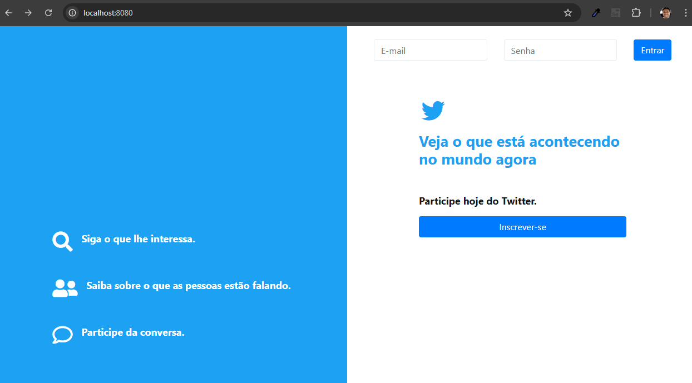
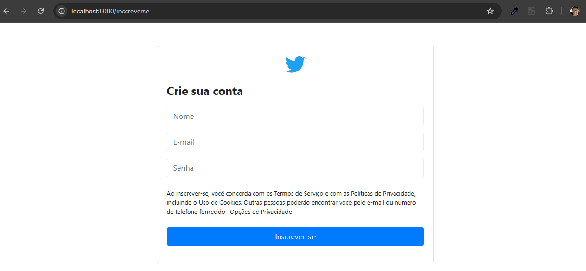
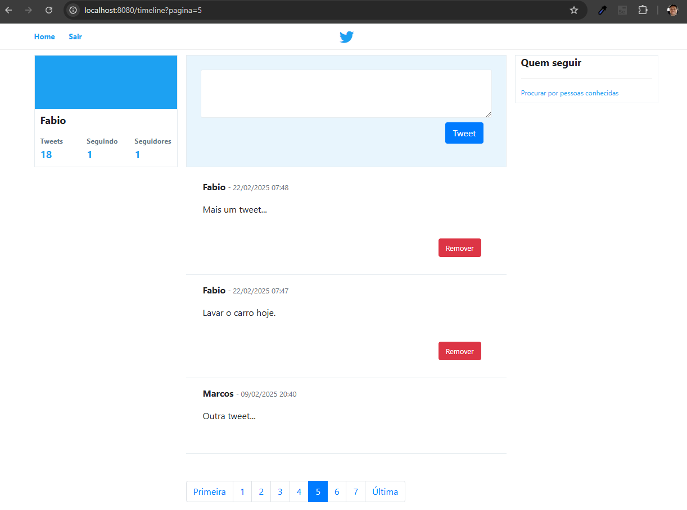
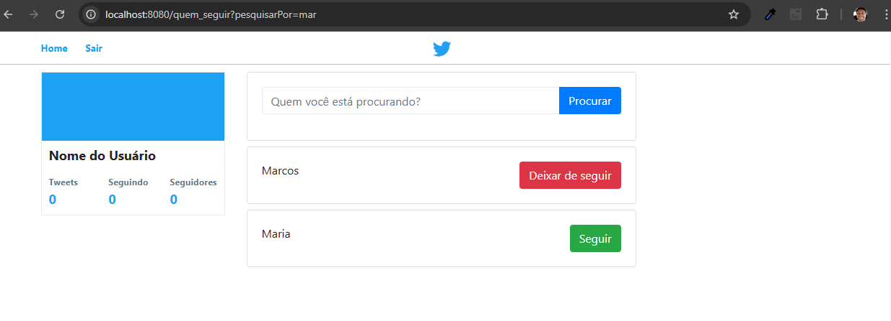

# Twitter_Clone

Curso online:

Domine Web - 20 Cursos - HTML5, CSS3, SASS, Bootstrap, JS, ES6, PHP, MySQL, JQuery, MVC, APIs, IONIC e muito mais

Autores:
Jorge Sant Ana e Jamilton Damasceno

Desenvolvimento de uma réplica da rede social Twitter aplicando boas práticas de MVC (Model-View-Controller) na linguagem PHP. 

>Figura 1: Tela inicial

>Figura 2: Increver-se

>Figura 3: Timeline

>Figura 4: Pesquisa de outros usuários

 

